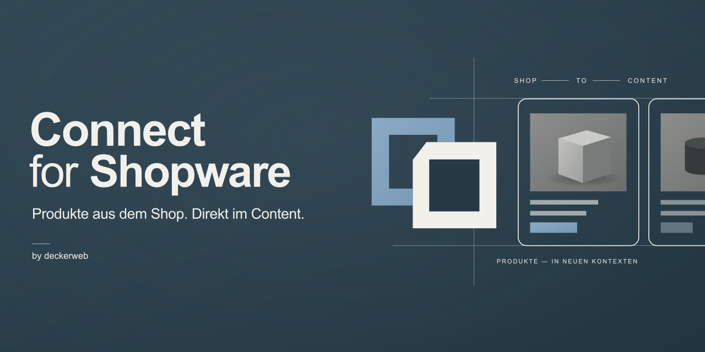
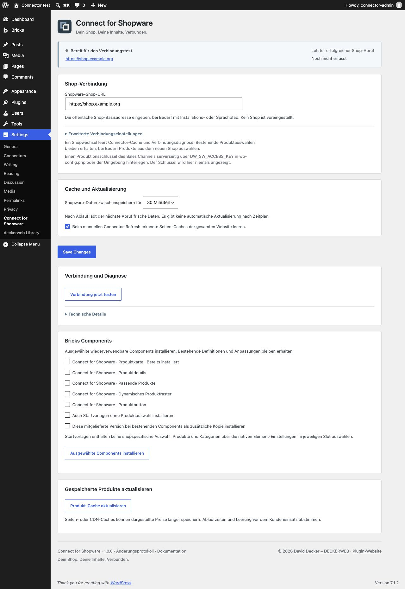

# Connect for Shopware

Shopware-Produkte direkt in Gutenberg und Bricks anzeigen.

[English](README.md) · [Ausführliche Anleitung](https://github.com/deckerweb/connect-for-shopware/wiki/Deutsch) · [FAQ](https://github.com/deckerweb/connect-for-shopware/wiki/FAQ-Deutsch)

[Funktionen](#0) · [Voraussetzungen](#1) · [Installation](#2) · [Bedienung](#3) · [FAQ](#4) · [Einstellungen](#einstellungen) · [Änderungen](#5)

## Funktionen

Produkte/Varianten, Galerie, Beschreibung, Datenblätter, Hersteller, Shopware-Preise, dynamische Kategorien, passende Produkte, CTA, Schnellansicht. Gemeinsamer Core mit Cache und Diagnose. Kein Warenkorb/Checkout und keine doppelte Produktpflege.

Kompakte Connect-Einstellungen mit sichtbarem Verbindungsstatus, aufklappbaren technischen Details und optionalem deckerweb-Plugin-Katalog.

## Voraussetzungen

WordPress ≥ 6.6 · PHP ≥ 8.1 · Bricks Components ≥ 2.4.2 · Shopware 6.7 Store API.

## Installation

Das [Plugin-ZIP aus dem aktuellen Release](https://github.com/deckerweb/connect-for-shopware/releases/latest) unter Plugins → Installieren → Plugin hochladen installieren und aktivieren. Unter Einstellungen → Connect for Shopware die öffentliche HTTPS-Shop-Adresse speichern. `DW_SW_ACCESS_KEY` serverseitig in wp-config.php oder der PHP-Umgebung bereitstellen und die Verbindung testen. Bei einem Update bleiben Einstellungen und Produktzuordnungen erhalten.

## Bedienung

Im Editor Produkt auswählen. Optional unter Einstellungen → Connect for Shopware Bricks Components und Beispiele installieren. Bestehende Components bleiben unangetastet.

## FAQ

**Preise lokal berechnet?** Nein. **Components erforderlich?** Nein. **Updates überschreiben Designs?** Nein. **Updates?** Veröffentlichte stabile Releases erscheinen unter WordPress-Updates. Automatische Updates bleiben deine Entscheidung.

## Einstellungen

## Änderungen

### 1.0.0 · 2026-10-06
- **Neu:** Shopware-Produkte und Varianten lesend in nativen Gutenberg-Blöcken und Bricks-Elementen anzeigen.
- **Neu:** Produktgalerie, Beschreibungen, Datenblätter, Hersteller, Shopware-Preise und Verfügbarkeit.
- **Neu:** Passende Artikelprodukte, dynamische Produktraster, Produktbuttons und optionale Schnellansicht.
- **Neu:** Konfigurierbare Shop-Verbindung, Cache, Diagnose und optionale Bricks Components.
- **Neu:** WordPress-Updates von GitHub, optionaler deckerweb-Plugin-Katalog und deutsche Übersetzungen.

© 2026 [David Decker – DECKERWEB](https://github.com/deckerweb) · GPL v2 or later (SPDX GPL-2.0-or-later).
