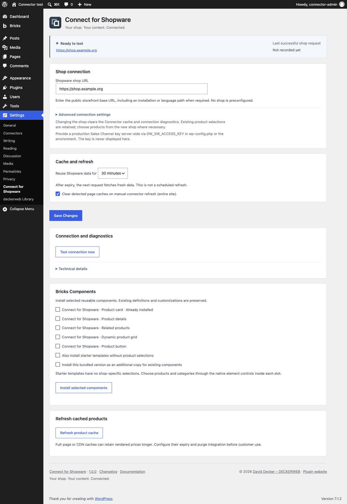

# Connect for Shopware

Display Shopware products in your WordPress content using native Gutenberg blocks and Bricks elements. Shopware supplies the product data and prices.

**Version:** 1.0.1 · WordPress ≥ 6.6 · PHP ≥ 8.1 · Bricks Components ≥ 2.4.2 · Shopware 6.7 Store API.

[Deutsch](README-de.md) · [Guide](https://github.com/deckerweb/connect-for-shopware/wiki/English) · [FAQ by topic](https://github.com/deckerweb/connect-for-shopware/wiki/FAQ-English)

[At a glance](#glance) · [Installation and first steps](#install) · [Main features](#features) · [FAQ](#faq) · [Settings](#screens) · [Changelog](#history) · [About the project](#author) · [Support and security](#support)

## At a glance

- Products and exact variants, gallery, descriptions, data sheets and manufacturer.
- Shopware prices, reference/list prices, availability and direct product links.
- Article-related products, dynamic groups, standalone buttons and optional Quick View.
- Shared display controls for Gutenberg and Bricks; optional Bricks Components.
- Site-scoped connection, diagnostics and 15/30/60-minute cache.

## Installation and first steps

1. Download the plugin ZIP from the [latest release](https://github.com/deckerweb/connect-for-shopware/releases/latest) and upload it under Plugins → Add New → Upload Plugin.
2. Save the public HTTPS shop URL under Settings → Connect for Shopware.
3. Provide `DW_SW_ACCESS_KEY` through wp-config.php or the PHP environment and test the connection.

## Main features

### Products in content

Search by name or product number. Select a family or an exact size/color variant. Choose the fields, image layout, gallery, detail tabs and shop button.

### Shopware keeps the rules and prices

Dynamic grids use active Shopware categories backed by product groups. Product data, availability, prices and rule evaluation remain in Shopware. There is no WordPress cart or checkout.

### Clear setup and safe updates

Configure one shop per site, keep the key server-side and test the connection. Cache and outage handling protect both installations. Native Bricks elements work without installing optional Components.

## FAQ

**Does WordPress calculate prices?**

No. Shopware supplies prices and discounts; WordPress displays them.

**What does the cache duration mean?**

Data is reused for 15, 30 or 60 minutes. The next request after expiry fetches fresh data.

**Do I need Bricks Components?**

No. Native elements work directly; Components are optional reusable layouts.

**Can I connect several shops?**

Configure one shop per WordPress site. Each shop needs its own matching server-side key.

**Does the plugin work in Multisite?**

Yes. Each site configures its own shop, cache and article assignments. Library settings are shared per network.

**What happens when I deactivate or uninstall?**

Settings, article assignments and Components remain. Uninstall clears temporary Connector data; shared Library data follows its own settings.

**How do I obtain updates?**

Stable GitHub releases appear in the normal WordPress update system. Automatic updates remain your choice.

[Complete FAQ by topic](https://github.com/deckerweb/connect-for-shopware/wiki/FAQ-English).

## Settings

## Changelog

### 1.0.1 · 2026-10-06

- **Improved:** Load product styles only for rendered blocks and elements.
- **Fixed:** Complete German formal translations for settings, editor controls and update messages.
- **Fixed:** Remove Connector temporary caches and locks on uninstall while preserving settings, assigned products and installed Components.
- **Fixed:** Resolve explicit server-side credentials per Multisite site while retaining the global-key fallback.
- **Misc:** Complete bilingual documentation, release metadata and shared component integration.

### 1.0.0 · 2026-10-06

- **New:** Read-only Shopware products and variants in native Gutenberg blocks and Bricks elements.
- **New:** Product gallery, descriptions, data sheets, manufacturer, Shopware prices and availability.
- **New:** Article-related products, dynamic product grids, product buttons and optional Quick View.
- **New:** Configurable shop connection, cache, diagnostics and optional Bricks Components.
- **New:** WordPress updates from GitHub, optional deckerweb plugin catalog and German translations.

## About the project

Connect for Shopware is developed and published by [David Decker – DECKERWEB](https://github.com/deckerweb). It is part of the Connect series and links existing systems without duplicating product maintenance.

## Support and security

[Issues](https://github.com/deckerweb/connect-for-shopware/issues) · [Discussions](https://github.com/deckerweb/connect-for-shopware/discussions) · [Private security reporting](https://github.com/deckerweb/connect-for-shopware/security/advisories/new)

Support the project: [Ko-fi](https://ko-fi.com/deckerweb) · [Buy Me a Coffee](https://buymeacoffee.com/daveshine) · [PayPal](https://paypal.me/deckerweb)

© 2026 David Decker – DECKERWEB · GPL v2 or later · SPDX GPL-2.0-or-later.

[Credits and licenses](docs/CREDITS.md).
