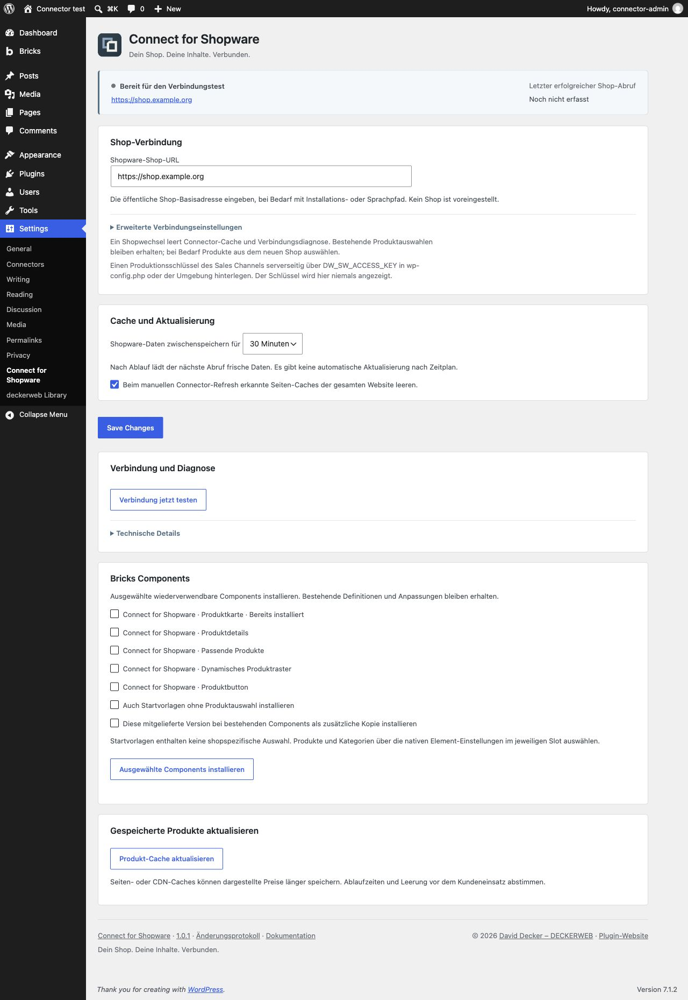

# Connect for Shopware

Shopware-Produkte mit nativen Gutenberg-Blöcken und Bricks-Elementen in WordPress-Inhalten anzeigen. Shopware liefert Produktdaten und Preise.

**Version:** 1.0.1 · WordPress ≥ 6.6 · PHP ≥ 8.1 · Bricks Components ≥ 2.4.2 · Shopware 6.7 Store API.

[English](../) · [Anleitung](https://github.com/deckerweb/connect-for-shopware/wiki/Deutsch) · [Fragen nach Themen](https://github.com/deckerweb/connect-for-shopware/wiki/FAQ-Deutsch)

[Auf einen Blick](#glance) · [Installation und erste Schritte](#install) · [Hauptfunktionen](#features) · [FAQ](#faq) · [Einstellungen](#screens) · [Änderungsverlauf](#history) · [Über das Projekt](#author) · [Hilfe und Sicherheit](#support)

## Auf einen Blick

- Produkte und konkrete Varianten, Galerie, Beschreibungen, Datenblätter und Hersteller.
- Shopware-Preise, Grund-/Streichpreise, Verfügbarkeit und direkte Produktlinks.
- Passende Artikelprodukte, dynamische Gruppen, Produktbuttons und optionale Schnellansicht.
- Gemeinsame Darstellung in Gutenberg und Bricks; optionale Bricks Components.
- Websitebezogene Verbindung, Diagnose und Cache für 15/30/60 Minuten.

## Installation und erste Schritte

1. Das Plugin-ZIP aus dem [aktuellen Release](https://github.com/deckerweb/connect-for-shopware/releases/latest) herunterladen und in WordPress unter Plugins → Installieren → Plugin hochladen installieren.
2. Unter Einstellungen → Connect for Shopware die öffentliche HTTPS-Shop-Adresse speichern.
3. `DW_SW_ACCESS_KEY` in wp-config.php oder der PHP-Umgebung bereitstellen und die Verbindung testen.

## Hauptfunktionen

### Produkte im Inhalt

Nach Name oder Artikelnummer suchen. Eine Familie oder eine konkrete Gebinde-/Farbvariante auswählen. Felder, Bildanordnung, Galerie, Detailtabs und Shopbutton bestimmen.

### Regeln und Preise bleiben in Shopware

Dynamische Raster verwenden aktive Shopware-Kategorien mit Produktgruppen. Produktdaten, Verfügbarkeit, Preise und Regelauswertung bleiben in Shopware. Es gibt keinen WordPress-Warenkorb oder Checkout.

### Klare Einrichtung und sichere Updates

Pro Website einen Shop konfigurieren, Schlüssel serverseitig halten und Verbindung testen. Cache und Ausfallbehandlung schützen beide Installationen. Native Bricks-Elemente funktionieren ohne die optionalen Components.

## FAQ

**Berechnet WordPress Preise?**

Nein. Shopware liefert Preise und Rabatte; WordPress stellt sie dar.

**Was bedeutet die Cache-Dauer?**

Daten werden 15, 30 oder 60 Minuten verwendet. Nach Ablauf lädt der nächste Abruf frische Daten.

**Brauche ich Bricks Components?**

Nein. Native Elemente funktionieren direkt; Components sind optionale wiederverwendbare Layouts.

**Kann ich mehrere Shops verbinden?**

Pro WordPress-Website wird ein Shop konfiguriert. Jeder Shop benötigt seinen passenden serverseitigen Schlüssel.

**Funktioniert das Plugin in Multisite?**

Ja. Jede Website konfiguriert Shop, Cache und Artikelzuordnungen getrennt. Library-Einstellungen gelten je Netzwerk.

**Was passiert bei Deaktivierung oder Deinstallation?**

Einstellungen, Artikelzuordnungen und Components bleiben erhalten. Deinstallation leert temporäre Connector-Daten; gemeinsame Library-Daten folgen ihren eigenen Einstellungen.

**Wie erhalte ich Updates?**

Stabile GitHub-Releases erscheinen im normalen WordPress-Updatesystem. Automatische Updates bleiben deine Entscheidung.

[Alle Fragen nach Themen](https://github.com/deckerweb/connect-for-shopware/wiki/FAQ-Deutsch).

## Einstellungen

## Änderungsverlauf

### 1.0.1 · 2026-10-06

- **Verbessert:** Produkt-Styles nur für dargestellte Blöcke und Elemente laden.
- **Behoben:** Vollständige deutsche Sie-Übersetzung für Einstellungen, Editor-Bedienelemente und Update-Meldungen.
- **Behoben:** Temporäre Connector-Caches und Sperren bei Deinstallation entfernen; Einstellungen, Produktzuordnungen und installierte Components erhalten.
- **Behoben:** Explizite serverseitige Schlüssel je Multisite-Website zuordnen; globalen Schlüssel als Fallback erhalten.
- **Sonstiges:** Zweisprachige Dokumentation, Release-Metadaten und gemeinsame Komponenten vervollständigt.

### 1.0.0 · 2026-10-06

- **Neu:** Shopware-Produkte und Varianten lesend in nativen Gutenberg-Blöcken und Bricks-Elementen anzeigen.
- **Neu:** Produktgalerie, Beschreibungen, Datenblätter, Hersteller, Shopware-Preise und Verfügbarkeit.
- **Neu:** Passende Artikelprodukte, dynamische Produktraster, Produktbuttons und optionale Schnellansicht.
- **Neu:** Konfigurierbare Shop-Verbindung, Cache, Diagnose und optionale Bricks Components.
- **Neu:** WordPress-Updates von GitHub, optionaler deckerweb-Plugin-Katalog und deutsche Übersetzungen.

## Über das Projekt

Connect for Shopware wird von [David Decker – DECKERWEB](https://github.com/deckerweb) entwickelt und herausgegeben. Es gehört zur Connect-Serie und verbindet bestehende Systeme, ohne deren Produktpflege zu duplizieren.

## Hilfe und Sicherheit

[Issues](https://github.com/deckerweb/connect-for-shopware/issues) · [Discussions](https://github.com/deckerweb/connect-for-shopware/discussions) · [Private Sicherheitsmeldung](https://github.com/deckerweb/connect-for-shopware/security/advisories/new)

Das Projekt unterstützen: [Ko-fi](https://ko-fi.com/deckerweb) · [Buy Me a Coffee](https://buymeacoffee.com/daveshine) · [PayPal](https://paypal.me/deckerweb)

© 2026 David Decker – DECKERWEB · GPL v2 or later · SPDX GPL-2.0-or-later.

[Herkunft und Lizenzen](https://github.com/deckerweb/connect-for-shopware/blob/main/docs/CREDITS-de.md).
