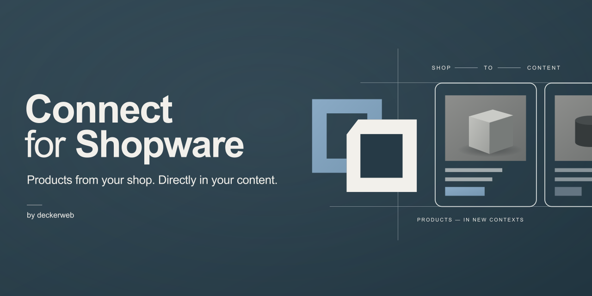

[Deutsch](de/) · [Documentation](https://github.com/deckerweb/connect-for-shopware/wiki/English) · [FAQ by topic](https://github.com/deckerweb/connect-for-shopware/wiki/FAQ-English)

# Shopware products in your WordPress content

Connect for Shopware displays products and variants using native Gutenberg blocks and Bricks elements. Shopware supplies product data, prices and dynamic-group rules. WordPress stores selections and presentation settings.

## At a glance

- Product cards, galleries, descriptions, data sheets and manufacturer details.
- Related article products, dynamic product grids, product buttons and optional Quick View.
- Configurable shop URL, server-side credentials and a 15/30/60-minute cache.
- Optional native Bricks Components and the shared deckerweb plugin catalog.
- No product import, cart or checkout in WordPress.

## Get started

[Download the latest release](https://github.com/deckerweb/connect-for-shopware/releases/latest). Upload the plugin ZIP in WordPress and activate it. Save the public HTTPS shop URL under Settings → Connect for Shopware, provide DW_SW_ACCESS_KEY server-side and test the connection.

WordPress 6.6+, PHP 8.1+, Shopware 6.7 Store API. Optional Bricks Components require Bricks 2.4.2+.

## Documentation and support

[Guide](https://github.com/deckerweb/connect-for-shopware/wiki/English) · [FAQ by topic](https://github.com/deckerweb/connect-for-shopware/wiki/FAQ-English) · [Changelog](https://github.com/deckerweb/connect-for-shopware/wiki/Changelog-English)

[Issues](https://github.com/deckerweb/connect-for-shopware/issues) · [Discussions](https://github.com/deckerweb/connect-for-shopware/discussions) · [Private security reporting](https://github.com/deckerweb/connect-for-shopware/security/advisories/new)

## Support the project

[Ko-fi](https://ko-fi.com/deckerweb) · [Buy Me a Coffee](https://buymeacoffee.com/daveshine) · [PayPal](https://paypal.me/deckerweb)

By [David Decker – DECKERWEB](https://github.com/deckerweb). © 2026 · GPL-2.0-or-later. The Cayman theme is CC0-1.0.
